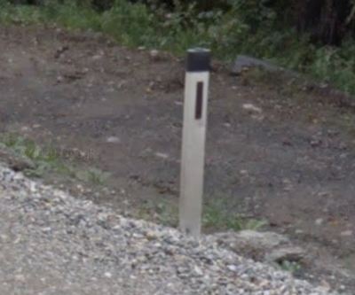
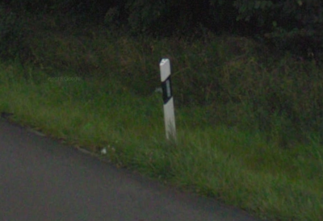
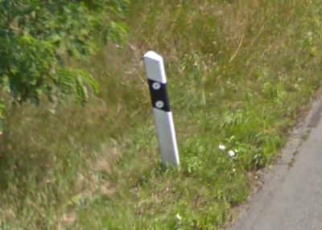
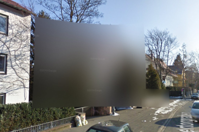

# Differences between Austria and Germany

* TOC
{:toc}

## Bollards

### Austria

_Copyright Google_

### Germany

_Copyright Google_

## Location

All Germany coverage is cities.

## Imagery

Many houses in Germany are blurred out.

_Copyright Google_

---

If you'd like to suggest an addition, please [submit a pull request on GitHub](https://github.com/ntzm/geo-stats/edit/master/docs/countries/at-de/index.md).
