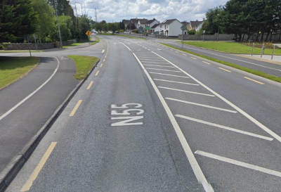
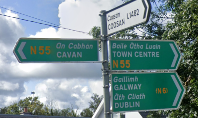

# Differences between United Kingdom and Ireland

## Licence plates

In the UK, cars have white licence plates on the front of the car and yellow licence plates at the rear of the car.

In Ireland, both the front and rear licence plates are white.

## Road lines

Road lines in Ireland will often have dashed yellow lines at the edges of the road.

_Copyright Google_

## Signs

Signs in Ireland will contain English and Gaelic in italics.

_Copyright Google_

## System of measurement

Ireland uses metric (km, km/h, m).

United Kingdom uses imperial (miles, mph, feet, yards).

## House style

Houses in rural Ireland are boxy, and often surrounded by a stone wall.

---

If you'd like to suggest an addition, please [submit a pull request on GitHub](https://github.com/ntzm/geo-stats/edit/master/docs/countries/gb-ie/index.md).
