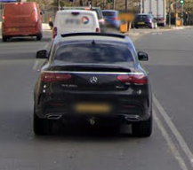

# Differences between United Kingdom and Ireland

* TOC
{:toc}

## Licence plates

### United Kingdom

In the UK, cars have white licence plates on the front of the car and yellow licence plates at the rear of the car.

_Copyright Google_

### Ireland

In Ireland, both the front and rear licence plates are white.

_Copyright Google_

## Road lines

Road lines in Ireland will often have dashed yellow lines at the edges of the road.

_Copyright Google_

## Signs

### United Kingdom

Signs in the UK will always contain English, but may also contain Welsh if you're in Wales.

_Copyright Google_

### Ireland

Signs in Ireland will contain English and Gaelic in italics.

_Copyright Google_

## System of measurement

### United Kingdom

United Kingdom uses imperial (miles, mph, feet, yards).

### Ireland

Ireland uses metric (km, km/h, m).

_Copyright Google_

## House style

Houses in rural Ireland are boxy, and often surrounded by a stone wall.

_Copyright Google_

---

If you'd like to suggest an addition, please [submit a pull request on GitHub](https://github.com/ntzm/geo-stats/edit/master/docs/countries/gb-ie/index.md).
