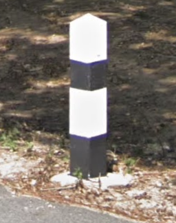

# Differences between Cambodia and Thailand

* TOC
{:toc}

## Driving side

Thailand drives on the left, whereas Cambodia drives on the right.

## Bollards

### Thailand

_Copyright Google_

Thai bollards are black and white.

### Cambodia

_Copyright Google_

Cambodian bollards are red and white.

---

If you'd like to suggest an addition, please [submit a pull request on GitHub](https://github.com/ntzm/geo-stats/edit/master/docs/countries/kh-th/index.md).
